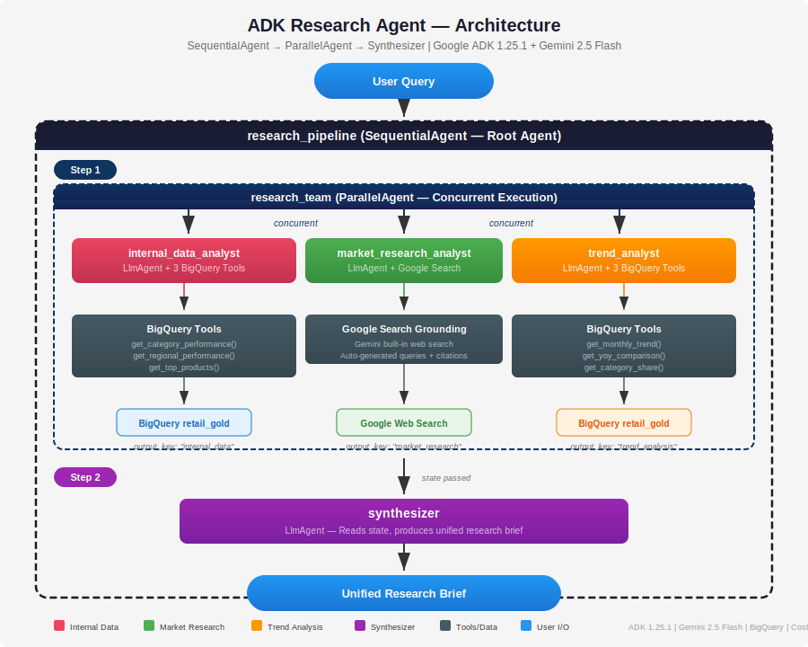
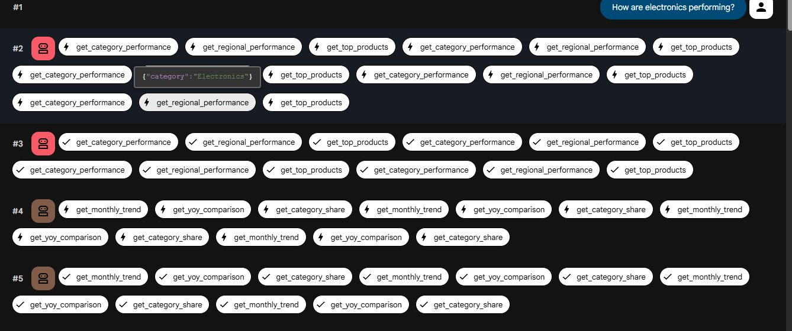
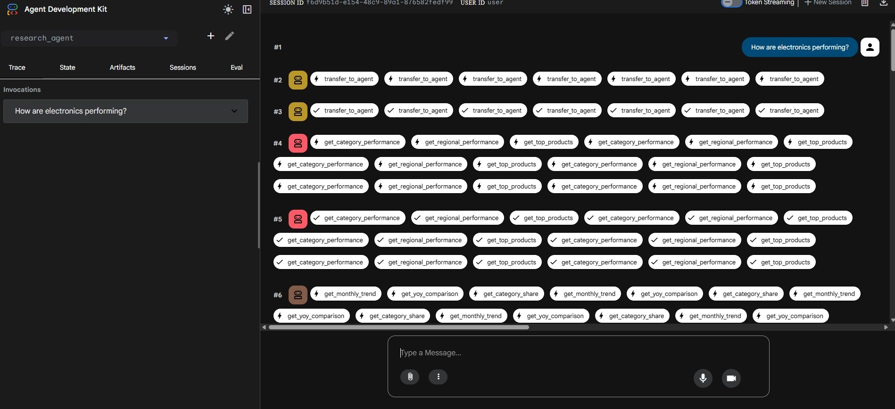
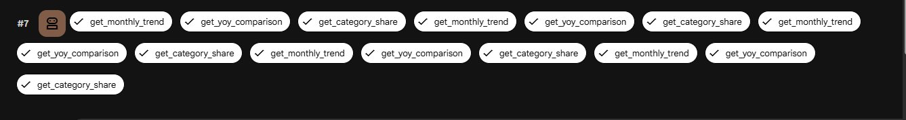
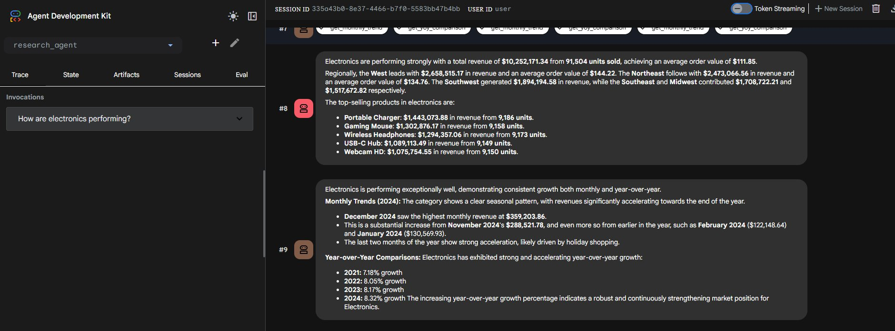
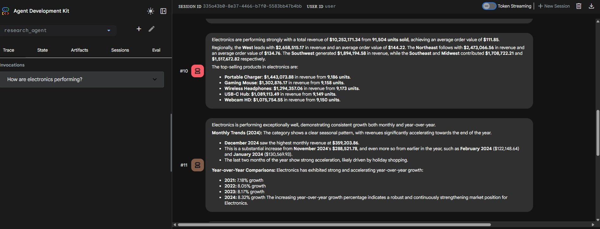
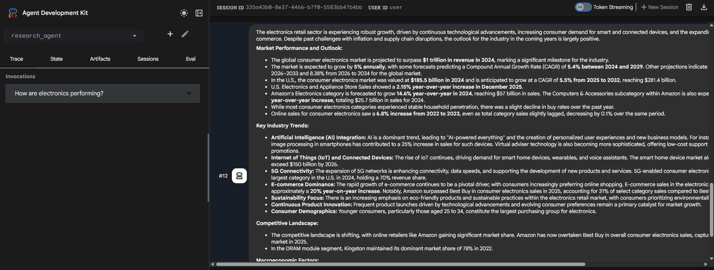
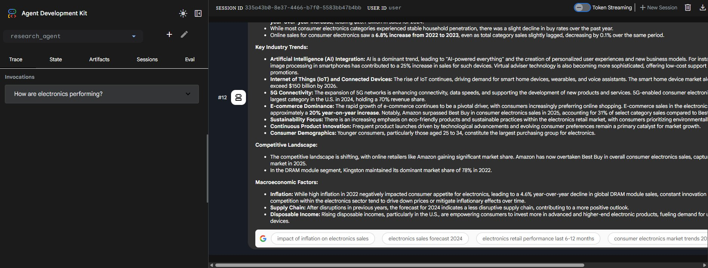

# ADK Research Agent

A multi-agent AI research system that queries internal data and searches the web simultaneously, then synthesizes everything into one executive brief. Built with Google Agent Development Kit (ADK), Gemini 2.5 Flash, BigQuery, and Google Search grounding.

## Architecture



```
research_pipeline (SequentialAgent — Root)
  ├── Step 1: research_team (ParallelAgent — Concurrent Execution)
  │     ├── internal_data_analyst (LlmAgent + 3 BigQuery tools)
  │     ├── market_research_analyst (LlmAgent + Google Search grounding)
  │     └── trend_analyst (LlmAgent + 3 BigQuery tools)
  └── Step 2: synthesizer (LlmAgent — Merges all results into unified brief)
```

The SequentialAgent guarantees ordering: all parallel data is gathered first (Step 1), then the synthesizer runs (Step 2) to produce one unified research brief. The ParallelAgent runs all 3 analysts concurrently, reducing wall-clock time.

## Key Features

- **ParallelAgent** runs 3 specialist agents concurrently (not sequential routing)
- **Google Search grounding** retrieves real-time market data, forecasts, and competitive intelligence
- **SequentialAgent synthesis** merges internal metrics + external context + historical trends into one executive brief
- **output_key state passing** stores each agent's results for structured synthesis
- **6 BigQuery tools** with parameterized SQL for security
- **456K rows** of synthetic retail data with realistic patterns

## Screenshots

| Screenshot | Description |
|-----------|-------------|
|  | SequentialAgent + ParallelAgent trace — all 3 agents executing concurrently |
|  | Parallel tool execution — BigQuery tools firing simultaneously |
|  | Trend analyst tools completed |
|  | Internal data analyst results — revenue, regions, top products |
|  | Trend analysis — monthly patterns, YoY growth, category share |
|  | Market research — industry forecasts from Google Search grounding |
|  | Competitive landscape and macroeconomic factors |
|  | Google Search grounding citation chips |

## Dataset

| Metric | Value |
|--------|-------|
| Total rows | 456,750 |
| Date range | 2020-01-01 to 2024-12-31 (5 years) |
| Regions | Northeast, Southeast, Midwest, West, Southwest |
| Categories | Electronics, Clothing, Home and Garden, Sports, Grocery |
| Products | 50 (10 per category) |

**Built-in patterns:** Holiday seasonality (Q4 Electronics/Grocery), summer peaks (Sports/Home & Garden), category growth trends (Electronics 8%, Home & Garden 12%), regional variation (West leads Electronics at 1.4x), deterministic product weights.

## Tech Stack

| Component | Technology |
|-----------|-----------|
| Agent Framework | Google ADK 1.25.1 |
| LLM | Gemini 2.5 Flash |
| Data Warehouse | BigQuery |
| External Search | Google Search grounding |
| Language | Python 3.12 |
| Auth | gcloud application-default credentials |

## Tools

| Tool | Agent | Description |
|------|-------|-------------|
| `get_category_performance()` | internal_data_analyst | Revenue, units, AOV for a category |
| `get_regional_performance()` | internal_data_analyst | Regional breakdown with revenue/units |
| `get_top_products()` | internal_data_analyst | Top products by revenue |
| `get_monthly_trend()` | trend_analyst | Month-over-month revenue trend |
| `get_yoy_comparison()` | trend_analyst | Year-over-year growth with LAG() |
| `get_category_share()` | trend_analyst | Revenue share across all categories |
| `google_search` | market_research_analyst | Gemini built-in web search with citations |

## Example Queries

| Query | Agents Activated | Tools Used |
|-------|-----------------|------------|
| "How are electronics performing?" | All 3 + synthesizer | All 6 BQ tools + Google Search |
| "Compare grocery and clothing" | All 3 + synthesizer | category_performance × 2 + trends + search |
| "What is the retail market outlook?" | All 3 + synthesizer | category_share + yoy + Google Search |
| "Which region is strongest for electronics?" | All 3 + synthesizer | regional_performance + trends + search |

## Project Structure

```
adk-research-agent/
├── research_agent/
│   ├── __init__.py                  # Exports root agent
│   ├── agent.py                     # SequentialAgent + ParallelAgent + 4 LlmAgents
│   ├── research_eval.evalset.json   # 10-case eval set
│   └── tools/
│       ├── __init__.py              # Tool exports
│       ├── internal_tools.py        # 3 BigQuery tools (current metrics)
│       └── trend_tools.py           # 3 BigQuery tools (historical trends)
├── scripts/
│   └── generate_data.py             # Synthetic data generator (456K rows)
├── docs/
│   ├── ARCHITECTURE.md              # Architecture Decision Records
│   ├── QA_GUIDE.md                  # 12-part in-depth Q&A
│   ├── architecture_diagram.svg     # Full architecture visualization
│   └── screenshots/                 # 8 annotated screenshots
├── requirements.txt
└── README.md
```

## Quick Start

```bash
# 1. Clone
git clone https://github.com/gbhorne/adk-research-agent.git
cd adk-research-agent

# 2. Install dependencies
pip install -r requirements.txt

# 3. Set environment variables
export GOOGLE_API_KEY="your-api-key"
export GOOGLE_CLOUD_PROJECT="your-project-id"

# 4. Create BigQuery dataset
bq mk --dataset --location=US $GOOGLE_CLOUD_PROJECT:retail_gold

# 5. Generate and load synthetic data
python scripts/generate_data.py

# 6. Launch agent
export PATH="$HOME/.local/bin:$PATH"
adk web .
```

## Architecture Decisions

| ADR | Decision | Reason |
|-----|----------|--------|
| ADR-1 | ADK over LangGraph/CrewAI | Native GCP integration, Gemini-optimized |
| ADR-2 | SequentialAgent root | LlmAgent root couldn't synthesize parallel results |
| ADR-3 | ParallelAgent for research | Breadth over routing — 3 perspectives simultaneously |
| ADR-4 | Google Search grounding | Zero config, automatic citations |
| ADR-5 | Fixed SQL over text-to-SQL | Reliability, security, cost control |
| ADR-6 | Separated internal vs trend analysts | True parallel execution of BigQuery tools |
| ADR-7 | output_key for state passing | Structured access for synthesizer |
| ADR-8 | Synthetic data with patterns | Ground truth for validation |

Full details: [docs/ARCHITECTURE.md](docs/ARCHITECTURE.md)

## Testing

**All agent structure, imports, BigQuery data, and tool tests passing.**

## Portfolio Context

| # | Project | Pattern | Key Technology |
|---|---------|---------|---------------|
| 1 | Enterprise Analytics | Star schema data platform | BigQuery, dbt, Cloud Composer |
| 2 | Terraform IaC | 49-resource infrastructure | Terraform, GCS, IAM |
| 3 | [ADK Retail Agents](https://github.com/gbhorne/adk-retail-agents) | Orchestrator → specialist routing | ADK, transfer_to_agent |
| 4 | [ADK NL2SQL Agent](https://github.com/gbhorne/adk-nl2sql-agent) | Dynamic SQL generation | ADK, text-to-SQL |
| 5 | [ADK Anomaly Detection](https://github.com/gbhorne/adk-anomaly-detection-agent) | BigQuery ML integration | ADK, ARIMA_PLUS |
| 6 | **ADK Research Agent** | **Parallel execution + synthesis** | **ADK, ParallelAgent, Google Search** |

## License

MIT
